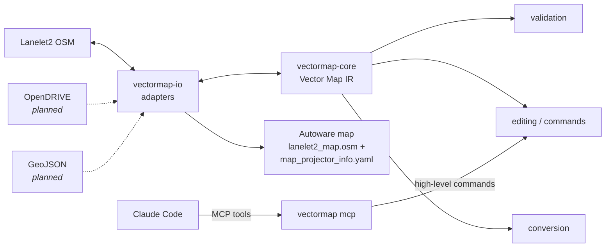

# vectormap-rs

> A Rust-native vector map toolkit for autonomous driving and robotics.

`vectormap-rs` provides a **format-independent vector map core**: a strongly
typed intermediate representation (IR) of lanes, boundaries, junctions and
traffic rules, with separate geometry and topology, deterministic high-level
editing operations, machine-readable validation, and adapters for external
formats — starting with Lanelet2 and the Autoware conventions on top of it.



## Motivation

HD vector maps are usually edited in, and tied to, one format. Lanelet2 is
the de-facto standard in Autoware, OpenDRIVE dominates simulation, GIS tools
speak GeoJSON — and tooling that works on "a map" ends up re-implementing the
same concepts (lanes, successors, stop lines, signals) for each of them.

`vectormap-rs` separates *what a vector map is* from *how a format encodes
it*:

- the **core** models lanes, topology and rules in plain, strongly typed
  Rust, with no knowledge of any file format;
- **adapters** translate formats to and from the core (Lanelet2 is an
  adapter, not the internal model);
- **all edits are high-level operations** (`split_lane`, `add_stop_line`,
  ...) that return a change set, so that tools — and language models driving
  them through MCP — can change a map safely and deterministically without
  ever touching XML.

## Features

- **Vector Map IR** — `Lane`, `Boundary`, `Road`, `Junction`, `StopLine`,
  `TrafficSignal`, `Crosswalk`, `RegulatoryElement`, each with its own ID
  newtype (`LaneId`, `BoundaryId`, ...) and an extensible attribute map.
- **Geometry** — `Point2/3`, `Polyline2/3`, `Polygon2/3`, `BoundingBox`;
  length, distance, nearest point (station + lateral offset), interpolation,
  resampling, splitting, offsetting. No heavy dependencies.
- **Topology** — stored separately from geometry: predecessors, successors,
  left/right neighbors (same or opposite direction), always kept symmetric;
  inference from geometry for formats with implicit topology.
- **Building** — `build_road` lays out a whole road along a reference line
  (a driven path, a road centre, observed lane markings): lanes in both
  directions with shared boundaries, neighbors and connected pieces;
  `add_connector` joins lanes through junctions with smooth turning lanes.
- **Editing API** — `add_lane`, `remove_lane`, `connect`, `disconnect`,
  `set_neighbor`, `split_lane` (splits the whole lateral group),
  `merge_lanes`, `add_stop_line`, `add_traffic_signal`, `add_crosswalk`,
  `set_speed_limit`, ... Every operation validates before it mutates and
  returns a `ChangeSet { created, modified, deleted, warnings }`.
- **Commands** — the same operations as serde-tagged JSON
  (`{"op": "split_lane", "lane": 12, "at": {"fraction": 0.5}}`), applied one
  by one or as an atomic batch.
- **Validation** — 20+ checks (dangling references, asymmetric links,
  invalid neighbors, degenerate geometry, duplicate IDs, disconnected
  topology, ...) reported as structured issues with stable codes and, where
  possible, a suggested fix command.
- **Lanelet2** — OSM XML import/export with faithful bound orientation
  (Lanelet2's `align`), topology inference, node sharing on export,
  `lanelet2:*` attribute preservation and exact round trips.
- **Autoware** — export profile, compatibility lint and
  `map_projector_info.yaml`; traffic lights with light bulbs, stop signs,
  crosswalks, intersection areas, speed limits, local coordinates.
- **JSON IR** — lossless, deterministic, readable by humans and LLMs.
- **Deterministic** — same input + same commands ⇒ byte-identical output.
- **MCP server** — `vectormap mcp` exposes the map to Claude Code and other
  MCP clients as 25 tools (`get_map_summary`, `find_nearest_lane`, `build_road`,
  `split_lane`, `add_traffic_light`, `validate_map`, `export_lanelet2`, ...)
  with undo; see [docs/mcp.md](docs/mcp.md).
- **CLI** — `vectormap info | validate | convert | edit | lane | nearest | sample | mcp`.

## Architecture

```text
vectormap-rs/
├── crates/
│   ├── vectormap-core/        IR, geometry, topology, editing, commands, queries
│   ├── vectormap-validation/  structured validation
│   ├── vectormap-io/          JSON IR, Lanelet2 adapter, Autoware profile, projection
│   ├── vectormap-mcp/         MCP server (JSON-RPC over stdio, tools, undo)
│   └── vectormap-cli/         the `vectormap` binary
├── src/lib.rs                 `vectormap` facade crate re-exporting the above
├── examples/                  quickstart, commands (MCP-style), Autoware map
├── tests/                     cross-crate integration tests + fixture maps
└── docs/                      format and API notes
```

`vectormap-core` has no knowledge of any file format; format and Autoware
specifics live in `vectormap-io`. See [ARCHITECTURE.md](ARCHITECTURE.md) for
the design and its rationale.

## Quick Start

```toml
[dependencies]
vectormap = { git = "https://github.com/rsasaki0109/vectormap-rs" }
```

```rust
use vectormap::io::lanelet2;
use vectormap::prelude::*;
use vectormap::validation::{validate, ValidationOptions};

fn main() -> Result<(), Box<dyn std::error::Error>> {
    // Load a Lanelet2 map (coordinates, georeference and topology are derived).
    let loaded = lanelet2::load_lanelet2("map.osm", &Default::default())?;
    let mut map = loaded.map;

    // Query topology.
    let lane = map.lanes().next().unwrap().id;
    println!("successors of {lane}: {:?}", map.successors(lane));

    // Edit with high-level operations.
    let (second_half, changes) =
        map.split_lane(lane, SplitAt::Fraction(0.5), SplitOptions::default())?;
    println!("created {:?}", changes.created);
    map.set_speed_limit(&[lane, second_half], Some(SpeedLimit::from_kmh(30.0)))?;

    // Validate.
    let report = validate(&map, &ValidationOptions::default());
    for issue in &report.issues {
        println!("{issue}");
    }

    // Export for Autoware.
    lanelet2::save_lanelet2(&map, "edited.osm", &lanelet2::SaveOptions::autoware())?;
    Ok(())
}
```

The same edits as data — what an MCP server would receive:

```rust
let commands: Vec<Command> = serde_json::from_str(r#"[
    {"op": "split_lane", "lane": 12, "at": {"fraction": 0.5}},
    {"op": "add_traffic_signal", "lanes": [15]},
    {"op": "set_speed_limit", "lanes": [12], "kmh": 30}
]"#)?;
let change_sets = map.apply_all(&commands)?; // atomic: all or nothing
```

Runnable examples:

```bash
cargo run --example quickstart     # build, edit, validate, export
cargo run --example commands       # MCP-style command workflow
cargo run --example autoware_map   # writes examples/autoware/
```

## CLI

```bash
cargo install --path crates/vectormap-cli
```

```bash
vectormap info map.osm                     # summary (use --json for machine output)
vectormap validate map.osm                 # structured issues; exit 1 on errors
vectormap validate --autoware --json map.osm

vectormap convert --from lanelet2 --to lanelet2 input.osm output.osm
vectormap convert --from lanelet2 --to json map.osm map.json
vectormap convert --autoware map.json out/lanelet2_map.osm   # + map_projector_info.yaml

vectormap edit map.osm commands.json -o edited.osm   # atomic batch, prints change sets
vectormap lane map.osm 12                            # everything about lane 12
vectormap nearest map.osm 25.0 -1.5                  # nearest lane to a point
vectormap sample intersection demo.osm               # built-in sample maps
vectormap mcp [map.osm]                              # MCP server on stdio
```

### Claude Code

```bash
claude mcp add vectormap -- vectormap mcp
```

Then ask, e.g., *"open examples/autoware/lanelet2_map.osm, split the lane
nearest to (20, 1.5) in the middle, validate it and export it for Autoware
to out/lanelet2_map.osm"*. Details: [docs/mcp.md](docs/mcp.md).

Formats are detected from the extension (`.osm` → Lanelet2, `.json` → IR) or
given with `--from` / `--to`. Lanelet2 input options: `--origin LAT,LON`
(`--projection utm|tm`) or `--local` to force how coordinates are obtained.

## Supported Formats

| Format | Read | Write | Notes |
|---|:---:|:---:|---|
| vectormap IR (JSON) | ✅ | ✅ | lossless; [docs/ir-json.md](docs/ir-json.md) |
| Lanelet2 (OSM XML) | ✅ | ✅ | lanelets, bounds, centerlines, traffic lights, stop lines, signs, right of way, crosswalks, intersection areas; [docs/lanelet2.md](docs/lanelet2.md) |
| Autoware Lanelet2 | ✅ | ✅ | profile + lint + `map_projector_info.yaml`; [docs/autoware.md](docs/autoware.md) |
| OpenDRIVE | — | — | planned |
| GeoJSON | — | — | planned |

More documentation: [MCP server](docs/mcp.md), [commands](docs/commands.md),
[validation codes](docs/validation.md).

## Roadmap

- [ ] OpenDRIVE import/export
- [ ] GeoJSON
- [ ] Map diff
- [ ] Map visualization
- [ ] Routing graph
- [ ] Point cloud assisted map creation
- [ ] ROS 2 integration
- [ ] Autoware integration tests
- [x] MCP server
- [ ] Claude Code map editing

Also on the list: MGRS projection output, detection areas / no-stopping
areas / speed bumps, spatial indexing (`rstar`) for large maps.

## Development

```bash
cargo fmt --all
cargo clippy --workspace --all-targets -- -D warnings
cargo test --workspace
UPDATE_GOLDEN=1 cargo test --test golden   # after intentional output changes
```

## License

Apache-2.0 — see [LICENSE](LICENSE).
